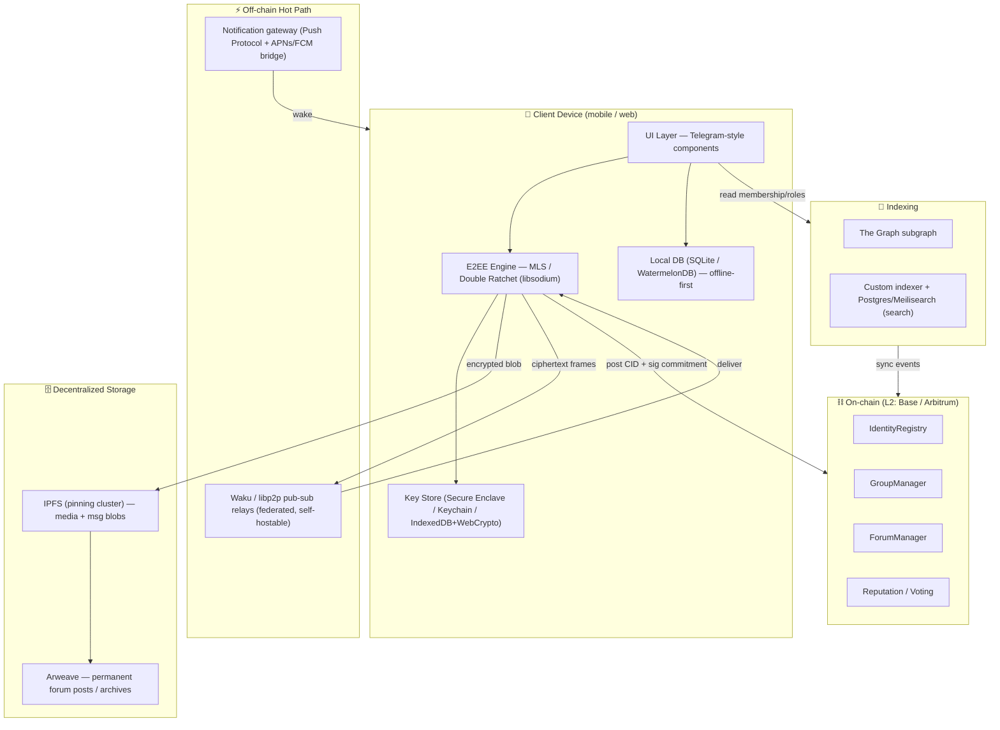
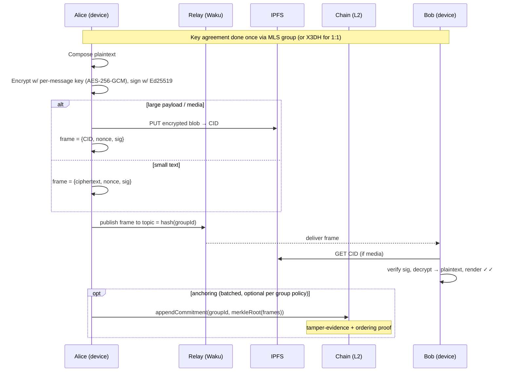
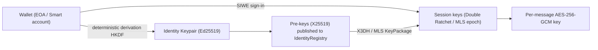

# TeleBlock — Decentralized, End-to-End-Encrypted Chat, Groups & Forums

> **Production specification & starter blueprint** for an open-source, blockchain-anchored secure messenger with a Telegram-grade UX.
>
> License target: **Apache-2.0** (patent grant matters for a protocol). License: see `LICENSE`.

---

## Table of Contents

1. [Project Overview](#1-project-overview)
2. [Architecture](#2-architecture)
3. [Tech Stack](#3-tech-stack)
4. [Detailed Feature Breakdown & User Stories](#4-detailed-feature-breakdown--user-stories)
5. [UI/UX Specifications](#5-uiux-specifications)
6. [Smart Contract Outlines](#6-smart-contract-outlines)
7. [Security & Privacy Model](#7-security--privacy-model)
8. [Scalability Strategy](#8-scalability-strategy)
9. [Starter Code Snippets](#9-starter-code-snippets)
10. [Roadmap](#10-roadmap)
11. [Deployment & Open Source Guide](#11-deployment--open-source-guide)
12. [Innovative Ideas](#12-innovative-ideas)

---

## 1. Project Overview

**Name:** **TeleBlock**
*(Alternative names considered: **Whisperchain**, **Hush**, **Veil**, **Konvo**. TeleBlock is kept for brand continuity, but **Veil** is the strongest fallback if a less "blockchain-loud" name is wanted — it foregrounds privacy over the chain.)*

**Tagline:** *"Telegram's feel. Your keys. No middleman."*

**Elevator pitch:**
TeleBlock is an open-source secure messenger that looks and feels like Telegram but removes the trusted server. Every message is end-to-end encrypted on-device, content lives on decentralized storage (IPFS/Arweave), and the blockchain anchors only what *must* be public and tamper-evident: your identity, group membership, roles, and forum governance. The result is real-time chat, massive groups, and Reddit-style forums where **no operator can read, censor, or seize your conversations** — and anyone can audit the protocol because all of it is open.

**Who it's for:**

| Segment | Need TeleBlock serves |
|---|---|
| Privacy-conscious mainstream users | A Telegram-quality app that is *actually* E2EE by default, with no phone number required. |
| Crypto-native communities (DAOs, NFT projects, L2 ecosystems) | Token-gated groups, on-chain roles, governance-driven forum moderation. |
| Activists / journalists | Censorship-resistant delivery, no central kill-switch, metadata minimization. |
| Open-source & dev communities | Self-hostable relays, forkable contracts, transparent moderation. |

**What makes it different (one line):** *Telegram's UX polish + Signal's crypto guarantees + on-chain governance for groups and forums, all open source.*

---

## 2. Architecture

### 2.1 Design principle: the three-layer split

TeleBlock separates concerns into three layers so blockchain latency never touches the chat experience:

- **Off-chain hot path (real-time):** message transport, typing, presence, delivery. Sub-second.
- **Decentralized storage (warm):** encrypted message blobs, media, profile data. Seconds, content-addressed.
- **On-chain anchor (cold, authoritative):** identity registry, group membership/roles, forum governance, reputation, content *commitments* (hashes), dispute settlement. Minutes-to-finality, but rarely on the critical path.

> **Rule of thumb:** *Plaintext never leaves the device. The chain stores commitments and rights, never content.*

### 2.2 System diagram



### 2.3 Encryption & message flow (1:1 and group)



**Why commitments, not content, on-chain:** posting a Merkle root of a batch of message hashes (every N messages or T seconds) gives **tamper-evidence and a verifiable ordering/anchor** at amortized near-zero gas, without leaking content or paying per-message.

### 2.4 Identity & key flow



> Wallet signs a **domain-separated** message once to derive a stable identity key; the wallet private key itself is *never* used to encrypt messages (signing keys ≠ encryption keys). This keeps hardware wallets compatible and lets users rotate messaging keys without changing their address.

---

## 3. Tech Stack

| Layer | Choice | Why | Alternatives (trade-off) |
|---|---|---|---|
| **Blockchain** | **Base (OP-Stack L2)** primary; Arbitrum supported | Cheap (<$0.01 typical tx), fast soft-confirms, EVM tooling, large user onboarding via Coinbase, Superchain interop | **Solana** (faster/cheaper but separate toolchain, account-model rewrite); **Optimism/zkSync**; **Polygon PoS** (cheaper but weaker security) |
| **Smart contracts** | **Solidity 0.8.x + OpenZeppelin + Foundry** | Audited primitives (AccessControl, ERC-1155 for memberships), best-in-class testing (fuzz/invariant) via Foundry | Hardhat (JS-centric); Rust/Anchor if Solana |
| **Account model** | **ERC-4337 smart accounts + EOA fallback** | Gasless onboarding (paymaster), social recovery, batched calls = great UX for newcomers | Plain EOA only (worse UX); MPC wallets |
| **E2EE protocol** | **MLS (RFC 9420)** for groups/forums; **Double Ratchet (X3DH)** for 1:1 | MLS gives **O(log n)** group rekeying → scales to thousands of members with forward secrecy & post-compromise security; Double Ratchet is the proven 1:1 standard | Sender Keys (Signal group, simpler but weaker PCS at scale); Megolm (Matrix) |
| **Crypto lib** | **libsodium** (via `libsodium-wrappers` / FFI) + **OpenMLS** (Rust→wasm) | Audited, constant-time, X25519/Ed25519/AES-GCM/XChaCha20 all present | WebCrypto (no XChaCha20, awkward key export); noble-curves (JS-pure) |
| **Transport (real-time)** | **Waku v2** (libp2p gossipsub) + reliable relay fallback | Decentralized pub-sub, store nodes for offline retrieval, metadata protection, self-hostable | XMTP (great DX, more centralized today); plain libp2p; WebSocket relay (centralized fallback) |
| **Messaging interop** | **XMTP-compatible content types** | Reuse XMTP's content-type framing & encode/decode patterns for portability | Custom protobuf only |
| **Content storage** | **IPFS** (hot, via Helia + pinning cluster) → **Arweave** (permanent forum archive) | Content-addressed dedupe, cheap hot storage, permanent cold storage for forums | Filecoin deals; Storj; S3 (centralized fallback) |
| **Mobile** | **Flutter** | Closest to Telegram's 60fps native feel, single codebase iOS+Android, excellent custom-paint for chat | React Native (more JS reuse, slightly worse perf); native ×2 (best perf, 2× cost) |
| **Web/Desktop** | **Next.js (React) + Tauri** for desktop | SSR for discovery pages, Tauri = small native desktop binary | Electron (heavier); Flutter Web (weaker SEO/text) |
| **UI components** | **TelegramUI (@telegram-apps/telegram-ui)** on web; custom Flutter widget kit mirroring it | High-fidelity Telegram look out of the box, theme params | Build from scratch; shadcn/ui (less Telegram-y) |
| **Indexing** | **The Graph** subgraph + **custom indexer (Node + Postgres)** | Subgraph for canonical on-chain reads; custom indexer for search & off-chain message metadata | Ponder; SubQuery; direct RPC (too slow for lists) |
| **Search** | **Meilisearch** (self-hostable) over indexer data; client-side encrypted-index for private chats | Fast typo-tolerant search; private chats searched locally only | Elasticsearch (heavier); Typesense |
| **Notifications** | **Push Protocol** + APNs/FCM bridge | Decentralized notif channel; bridge for OS-level delivery | OneSignal (centralized); Web Push only |
| **State/cache (client)** | **WatermelonDB / SQLite** + Riverpod (Flutter) / Zustand (web) | Offline-first, reactive, scales to large histories | Drift; Realm |
| **Auth** | **SIWE (Sign-In with Ethereum)** + WalletConnect v2; Solana: SIWS | Standard, phishing-resistant with domain binding | OAuth bridge for newcomers (custodial onboarding) |
| **CI/CD & infra** | GitHub Actions, Foundry CI, Docker, Terraform for relay/indexer fleet | Reproducible, community can self-host the whole stack | — |

---

## 4. Detailed Feature Breakdown & User Stories

Format: **As a `<role>`, I want `<capability>`, so that `<benefit>`.** Acceptance criteria (AC) included for the headline features.

### 4.1 Private 1:1 Chats

- **As a new user**, I want to start a chat by scanning a QR or pasting a username/ENS/address, so that I don't need a phone number.
- **As a user**, I want all 1:1 chats E2EE by default with forward secrecy, so that a stolen key can't decrypt past messages.
  - **AC:** Double Ratchet session established on first message; key rotates per message; verification via safety-number/QR; UI shows lock + verified badge.
- **As a user**, I want **self-destruct timers** (off / 1m / 1h / 1d / 1w), so that sensitive messages disappear on both devices.
  - **AC:** timer is part of encrypted frame; receiver enforces deletion locally; CID unpinned after expiry; screenshots flagged where OS allows.
- **As a user**, I want typing indicators and privacy-preserving online status ("recently", "last week", or hidden), so that I control metadata exposure.
- **As a user**, I want to send voice messages, files, images and videos via IPFS, so that media is decentralized and previewable.
- **As a user**, I want folders, pinned chats, archived chats, and full-text search of my *local* history, so that I stay organized like in Telegram.
- **As a user**, I want swipe-to-reply, emoji reactions, edit & delete-for-everyone, so the interaction set matches Telegram.

### 4.2 Group Chats (core)

- **As a group creator**, I want to create a **public or private** group of any size with smart-contract-managed membership, so that membership and roles are transparent and ownable.
  - **AC:** `GroupManager.createGroup()` mints an ERC-1155 membership collection; creator = owner role; group metadata CID stored on-chain; MLS group initialized client-side.
- **As an owner/admin**, I want **roles (owner, admin, member, restricted)** and **granular permissions** (post, add media, pin, delete others' messages, ban, change info, manage admins), so that moderation maps to Telegram's admin model.
  - **AC:** permissions stored as a bitmask per role on-chain; client enforces UI; relay/indexer reject ciphertext frames from banned keys; MLS removes banned member → epoch rekey so they lose forward access.
- **As an admin**, I want **slow mode, anti-spam, and join requests**, so that large public groups stay manageable.
- **As a member**, I want **invite links, QR codes, and on-chain/NFT invites (optionally soulbound)**, so that joining is flexible and optionally token-gated.
  - **AC:** invite = signed capability token (off-chain) OR claimable on-chain invite; token-gated groups check ERC-20/721/1155 balance via `IGate` adapter before issuing MLS KeyPackage.
- **As a member**, I want **@mentions, threaded replies, polls, pinned messages, shared media gallery**, so the group feels as rich as Telegram.
- **As a community**, I want **on-chain transparency for membership & key actions** (joins, bans, role changes, pins) while message bodies stay E2EE, so that moderation is auditable but conversations remain private.
- **As a large-group member (10k+)**, I want messages to deliver in real time without lag, so that scale doesn't degrade UX (see §8).

### 4.3 Forums (core)

- **As a community**, I want a **Forums section with categories/topics** that can be public, group-linked, or **DAO-governed**, so that long-form discussion has a home separate from fast chat.
  - **AC:** `ForumManager.createForum()` sets governance mode (`OWNER` | `MODERATOR_SET` | `DAO`); categories & topics are on-chain records pointing to content CIDs.
- **As a poster**, I want **threaded discussions** (original post + nested replies, Reddit/Discourse style) with **Markdown, embedded IPFS media, polls, and links**, so that content is rich and structured.
  - **AC:** posts stored as Arweave/IPFS docs; on-chain record = `{forumId, parentId, author, contentCID, contentHash, ts}`; nesting via `parentId`; client renders sanitized Markdown.
- **As a community member**, I want **token-weighted or reputation-weighted up/down voting** that affects visibility, so that quality surfaces and sybils are dampened.
  - **AC:** vote weight = `f(reputation, optional staked token)`; quadratic option to resist whales; visibility ranking = `score = upWeighted − downWeighted + recencyDecay`.
- **As a moderator/DAO**, I want **moderation via mod actions or governance proposals** (pin, hide, lock, ban), so that moderation is either fast (mods) or maximally legitimate (DAO vote).
  - **AC:** mod action emits event + reason CID; DAO mode routes the action through a `propose → vote → execute` flow (OZ Governor).
- **As a user**, I want **tagging, cross-forum search, and cross-posting from a group chat into a forum thread** (and back), so that ephemeral chat insights become durable.
  - **AC:** "Convert to forum thread" takes selected messages, re-encrypts/re-publishes (or publishes publicly if the group consents) as a forum OP, links back to source.
- **As an active participant**, I want **on-chain badges/achievements** and an **activity feed** of my forum + chat contributions, so that participation is recognized.

### 4.4 Additional Must-Haves

- **Wallet login** (WalletConnect/SIWE; Solana SIWS) **+ smart-account onboarding** (gasless first actions via paymaster, optional email/passkey-backed embedded wallet for newcomers).
- **Profiles**: avatar (IPFS), display name, ENS, bio, links, with **per-field privacy** (public / contacts / private).
- **Discovery**: trending groups, public forums, recommended users (ranked by on-chain reputation + activity, with explicit opt-in to be discoverable).
- **Notifications**: Push Protocol channels per group/forum, bridged to APNs/FCM; granular mute.
- **Settings**: themes, privacy (presence, read receipts, who-can-add-me), **network switcher** (Base/Arbitrum/…), **data export** (encrypted archive), self-destruct defaults.
- **Future**: WebRTC voice/video with decentralized signaling over Waku; open **bot protocol** (capability-scoped, E2EE-aware).

---

## 5. UI/UX Specifications

**North star:** a user who switches from Telegram should feel *no friction* — same gestures, same speed, same density — while privacy/ownership cues are present but never noisy.

**Global system:**
- **Dark mode default**, light + AMOLED-black + custom. Dynamic `themeParams` (bg, text, hint, link, button, accent) themable per-chat (Telegram-style wallpapers).
- **Type:** Inter / SF Pro / Roboto; 16sp body, 13sp meta.
- **Motion:** 60fps; spring physics for sheets; shared-element transitions chat-list→chat; haptics on send, long-press, pull-to-refresh.
- **Accessibility:** WCAG AA contrast, full screen-reader labels, dynamic type, reduced-motion mode, RTL.
- **Offline-first:** every screen renders from local DB; a subtle sync chip shows pending/anchoring state.

### Screen-by-screen

**1. Onboarding**
- Hero → "Connect Wallet" (WalletConnect modal) **or** "Create account" (passkey/email → embedded smart account, gasless).
- 3-card swipe explaining: *your keys*, *no phone number*, *messages no one can read*.
- Key backup prompt (recovery phrase / social recovery guardians).
- *Interaction:* SIWE signature → derive identity key → publish pre-keys (gasless via paymaster). Total time-to-first-chat target: **< 30s**.

**2. Chats list (Home)**
- Top: search bar + scan icon. Rows: avatar, name, last-message preview, timestamp, unread badge, muted icon, pin marker, **✓/✓✓ read state**.
- Swipe-right = archive; swipe-left = mute/delete; long-press = multi-select.
- **Bottom tab bar:** **Chats · Groups · Forums · Discover · Profile** (desktop: collapsible left sidebar with the same sections + 3-column layout: nav | list | conversation).
- Folder pills above the list (All, Unread, Groups, Custom…).

**3. Conversation (1:1 & group)**
- Message bubbles: **sent = accent (blue) right-aligned, received = surface (gray) left-aligned**; tails on last in group; grouped by author/time.
- Per-bubble: reactions row, reply quote, edited/forwarded labels, **✓/✓✓** + lock glyph; timestamp on swipe-left of the whole thread.
- **Gestures:** swipe-to-reply, double-tap to react, long-press → context menu (Reply, React, Copy, Forward, Pin, Edit, Delete, Convert→Forum).
- **Composer:** text + attach (camera, gallery, file, poll, location), **hold-to-record voice** with waveform & slide-to-cancel, emoji/sticker/GIF panel.
- Group header: avatar stack, member count, online count; tap → group profile (members with role chips, on-chain "View on explorer" link, shared media, settings).
- **Self-destruct:** flame icon sets timer; timed bubbles show a countdown ring.

**4. Group profile / admin**
- Sections: members (search, role chips, ban/promote), permissions matrix (Telegram-style toggles), invite links/QR, slow-mode slider, **"On-chain actions" log** (joins/bans/role changes with tx links), token-gate config.

**5. Forums**
- **Forums home:** category cards (icon, title, member/post counts, governance badge: 👤 owner / 🛡️ mods / 🏛️ DAO).
- **Topic list:** thread rows with title, author, tag chips, vote score, reply count, last-activity; sort: Hot / New / Top / Controversial.
- **Thread view:** OP card (rich Markdown, media, poll) → nested replies with collapse, inline vote arrows (weight tooltip), reply composer; mod bar (pin/lock/hide) for privileged users; **"Open governance proposal"** in DAO mode.
- **Compose post:** Markdown editor with live preview, media drop (→IPFS), tag picker, "post to" selector (forum/category), cross-post-from-chat entry point.

**6. Discover**
- Trending groups, public forums, recommended users; search with filters (topic, language, gated/open); reputation badges on profiles.

**7. Profile & Settings**
- Profile: avatar, ENS, bio, links, **badges shelf** (forum achievements), activity feed (chat+forum contributions), privacy toggles per field.
- Settings groups: Account & keys (backup, devices, key rotation), Privacy & security (presence, read receipts, blocked, who-can-add), Appearance (theme, wallpaper, bubble style), Notifications (per-channel), Data (export/import), **Network** (chain switcher, RPC, relay nodes — incl. "use my own relay/pin node"), Storage (cache, auto-download).

**Key interaction parity checklist (must match Telegram):** instant send optimism, jump-to-unread, reply/forward sheets, message multi-select, pinned-message bar, mention auto-complete, in-chat search with up/down nav, media viewer with swipe-between, pull-to-archive.

---

## 6. Smart Contract Outlines

All contracts: Solidity ^0.8.24, OpenZeppelin (`AccessControl`, `ERC1155`, `Governor`, `EIP712`, `ReentrancyGuard`), UUPS-upgradeable behind a timelocked multisig, emit rich events for The Graph. **No plaintext or PII on-chain — only addresses, CIDs, hashes, roles, and numeric state.**

### 6.1 `IdentityRegistry`

```
Storage
  mapping(address => Identity) identities   // {pubPreKeyBundleCID, signingPubKey, profileCID, updatedAt}
  mapping(bytes32 => address)  usernameToAddr

Functions
  register(bytes signingPubKey, string preKeyBundleCID, string profileCID)
  rotateKeys(bytes newSigningPubKey, string newPreKeyBundleCID)
  setProfile(string profileCID)
  claimUsername(bytes32 nameHash)

Events
  Registered(address indexed user, bytes signingPubKey, string preKeyBundleCID)
  KeysRotated(address indexed user, bytes newSigningPubKey)
  ProfileUpdated(address indexed user, string profileCID)
```

### 6.2 `GroupManager`

```
Storage
  struct Group {
    address owner;
    bytes32 metadataCID;        // name, avatar, description (encrypted for private groups)
    uint8   visibility;         // 0 public, 1 private, 2 token-gated
    address gate;               // IGate adapter (0 if none)
    uint32  memberCount;
    bool    slowMode; uint32 slowModeSecs;
    bytes32 mlsGroupId;         // binds on-chain group to MLS ciphersuite group
  }
  mapping(uint256 => Group) groups;                       // groupId => Group
  mapping(uint256 => mapping(address => uint16)) perms;   // groupId => member => permission bitmask
  mapping(uint256 => bytes32) lastCommitment;             // latest message Merkle root anchor

  // Permission bits: POST=1, MEDIA=2, INVITE=4, PIN=8, DELETE_OTHERS=16,
  //                  BAN=32, MANAGE_ADMINS=64, CHANGE_INFO=128, OWNER=0xFFFF

Functions
  createGroup(bytes32 metadataCID, uint8 visibility, address gate, bytes32 mlsGroupId) returns (uint256 groupId)
  join(uint256 groupId, bytes proof)            // checks gate; emits intent for MLS add
  requestJoin / approveJoin(...)                 // private groups
  setRole(uint256 groupId, address member, uint16 permMask)   // requires MANAGE_ADMINS
  ban(uint256 groupId, address member, bytes32 reasonCID)     // requires BAN
  setSlowMode(uint256 groupId, bool on, uint32 secs)
  setGate(uint256 groupId, address gate)
  appendCommitment(uint256 groupId, bytes32 merkleRoot)       // batched message anchor
  rotateMlsEpoch(uint256 groupId, bytes32 newMlsGroupId)      // on membership change

Events
  GroupCreated(uint256 indexed groupId, address indexed owner, uint8 visibility, bytes32 metadataCID)
  MemberJoined(uint256 indexed groupId, address indexed member)
  MemberBanned(uint256 indexed groupId, address indexed member, bytes32 reasonCID)
  RoleChanged(uint256 indexed groupId, address indexed member, uint16 permMask)
  CommitmentAppended(uint256 indexed groupId, bytes32 merkleRoot, uint256 batchSeq)
  MlsEpochRotated(uint256 indexed groupId, bytes32 newMlsGroupId)

Modifiers
  onlyPermitted(groupId, BIT)   // require perms[groupId][msg.sender] & BIT != 0
```

Membership token (separate `ERC1155Membership`): mint on join, burn on leave/ban; optional **soulbound** flag (non-transferable) for identity-bound membership.

### 6.3 `ForumManager`

```
Storage
  enum Governance { OWNER, MODERATOR_SET, DAO }
  struct Forum   { address owner; Governance gov; address governor; bytes32 metaCID; uint8 visibility; }
  struct Post    { uint256 forumId; uint256 parentId; address author; bytes32 contentCID; bytes32 contentHash; uint64 ts; int64 score; uint8 status; } // status: 0 active,1 hidden,2 locked,3 pinned
  mapping(uint256 => Forum) forums;
  mapping(uint256 => Post)  posts;                                  // postId => Post
  mapping(uint256 => mapping(address => int8)) voteOf;             // postId => voter => -1/0/+1
  mapping(uint256 => address[]) mods;                              // forumId => moderators

Functions
  createForum(bytes32 metaCID, Governance gov, address governor, uint8 visibility) returns (uint256 forumId)
  createPost(uint256 forumId, uint256 parentId, bytes32 contentCID, bytes32 contentHash) returns (uint256 postId)
  vote(uint256 postId, int8 dir)                  // weight resolved off-chain by indexer OR on-chain via Reputation
  moderate(uint256 postId, uint8 newStatus, bytes32 reasonCID)     // mods/owner; or DAO-executed
  addModerator / removeModerator(uint256 forumId, address mod)
  crossPostFromChat(uint256 forumId, bytes32 contentCID, bytes32 sourceRef)   // chat→forum bridge

Events
  ForumCreated(uint256 indexed forumId, address indexed owner, uint8 gov)
  PostCreated(uint256 indexed postId, uint256 indexed forumId, uint256 indexed parentId, address author, bytes32 contentCID)
  Voted(uint256 indexed postId, address indexed voter, int8 dir, uint256 weight)
  Moderated(uint256 indexed postId, uint8 newStatus, bytes32 reasonCID)
```

### 6.4 `Reputation` & voting weight

```
Storage
  mapping(address => uint256) rep;          // earned, non-transferable (soulbound score)
  mapping(bytes32 => bool)    badgeMinted;  // keccak(user,badgeId)

Functions
  award(address user, uint256 amount, bytes32 sourceRef)   // only callable by Forum/Group hooks
  mintBadge(address user, uint256 badgeId)                  // ERC-1155 soulbound achievement
  weight(address user) view returns (uint256)              // e.g. sqrt(rep) for quadratic-ish dampening

Hook: ForumManager.vote() -> weight = Reputation.weight(voter) (+ optional staked token term)
```

**Governance (DAO forums):** standard **OZ Governor + Timelock**; `moderate()`/`addModerator()` become `execute`-only targets so privileged forum actions require a passed proposal.

---

## 7. Security & Privacy Model

### 7.1 What the blockchain adds

- **Tamper-evident anchoring:** Merkle-root commitments prove message ordering/existence; a malicious relay can't silently drop or reorder anchored history without detection.
- **Censorship-resistant authority:** group roles, bans, and forum governance live on-chain — no operator can unilaterally seize a community; rules are code + (optionally) DAO votes.
- **Verifiable identity & keys:** pre-key bundles and signing keys are published immutably; MITM key substitution is detectable (and surfaced as a "safety number changed" warning).
- **Auditable moderation:** every ban/hide/pin emits an event with a reason CID → fully transparent mod log.

### 7.2 Cryptographic guarantees

| Property | Mechanism |
|---|---|
| Confidentiality | AES-256-GCM / XChaCha20-Poly1305 per-message keys; content never on-chain or in plaintext on relays/IPFS |
| Forward secrecy | Double Ratchet (1:1), MLS epoch ratchet (groups) |
| Post-compromise security | MLS commit/rekey on membership change; periodic self-update |
| Authenticity / integrity | Ed25519 signatures on every frame; `contentHash` anchored |
| Group scalability of secrecy | MLS TreeKEM → O(log n) rekey for thousands of members |
| Deniability (1:1) | Double Ratchet message keys are symmetric & ephemeral |

### 7.3 Threat model (STRIDE-style)

| Threat | Vector | Mitigation |
|---|---|---|
| **Spoofing** | Impersonate a user / key substitution | On-chain signing keys + safety-number verification + key-change warnings |
| **Tampering** | Relay/IPFS alters or reorders messages | Per-frame signatures + Merkle-root anchors; clients reject bad sigs; reorders detected vs. anchor |
| **Repudiation** | User denies an action | Signed frames + on-chain events for governance actions |
| **Information disclosure (content)** | Server/relay/storage reads messages | E2EE; relays see only ciphertext + topic; IPFS stores encrypted blobs |
| **Information disclosure (metadata)** | Who-talks-to-whom, timing, social graph | Waku topic hashing, cover traffic option, sealed-sender style addressing, optional Tor/mixnet transport, presence privacy controls |
| **Denial of service** | Spam, relay flooding, gas griefing | Slow mode, anti-spam, rate-limit nullifiers (RLN over Waku), proof-of-membership before publish, paymaster spend caps |
| **Elevation of privilege** | Non-admin performs admin action | On-chain permission bitmask enforced by contracts + client; banned keys removed from MLS epoch |
| **Sybil (forums)** | Fake accounts skew votes/discovery | Reputation-weighted + quadratic voting; optional proof-of-personhood gate; token-gating |
| **Key/device compromise** | Stolen device | Secure enclave key storage, biometric lock, remote device revocation, PCS rekey, self-destruct |
| **Supply chain** | Malicious dependency/build | Reproducible builds, pinned deps, SBOM, signed releases, contract audits |
| **Metadata at storage** | IPFS provider correlation | Encrypt before pin, rotate CIDs, no filename leakage, optional client-side ORAM for high-threat users |

### 7.4 Privacy-by-default choices
- No phone number, no email required (email only for optional recovery, hashed).
- Presence/read-receipts/typing are **opt-out** controls.
- Sealed-sender style: relays don't learn sender identity for delivery where possible.
- **Local-only search index** for private content; server search only over already-public forum content.
- Self-host everything: relay nodes, pinning nodes, indexer — the protocol must work with *your own* infra.

### 7.5 Assurance
- Foundry unit + **fuzz + invariant** tests; 90%+ contract coverage target.
- `cargo audit` / `npm audit` / Slither / Mythril in CI; **external audit before mainnet**.
- Public threat model doc, responsible-disclosure policy, bug bounty.
- Cryptographic review of MLS integration; constant-time checks via libsodium.

---

## 8. Scalability Strategy

**Goal:** millions of users, groups/forums with thousands of members, real-time feel, low cost.

1. **Keep the chain off the hot path.** Messages flow over Waku/libp2p in real time. Chain is touched only for membership/role/governance changes and **batched** commitments — never per message.

2. **Batch & amortize on-chain writes.** `appendCommitment` posts one Merkle root per N messages or T seconds per group → near-zero per-message gas. Multiple groups' roots can be batched in a single tx.

3. **MLS for sub-linear group crypto.** TreeKEM gives **O(log n)** rekey on join/leave, so a 5,000-member group rekeys in ~13 ops, not 5,000. This is the key enabler for huge groups with forward secrecy.

4. **Topic sharding & fan-out.** Each group/forum maps to a Waku content topic; very large groups shard into sub-topics with a deterministic distributor and **server-assisted fan-out relays** for delivery; store-nodes serve offline retrieval.

5. **Rate-limiting without identity leakage.** **RLN (Rate-Limiting Nullifiers)** over Waku let the network throttle spammers by zero-knowledge membership proof, no central gatekeeper.

6. **L2 + smart accounts.** Base/Arbitrum for cheap finality; ERC-4337 paymaster sponsors onboarding and batches user ops; gas griefing bounded by spend caps.

7. **Read scaling via indexing.** The Graph + custom indexer + Postgres/Meilisearch serve lists, search, discovery, and reputation fast — clients never scan the chain directly for UI.

8. **Media offloading & CDN.** Media on IPFS with a pinning cluster fronted by an IPFS gateway/CDN; popular content edge-cached; thumbnails generated client-side pre-encryption.

9. **Client efficiency.** Offline-first local DB, lazy history paging, virtualized lists, message coalescing, delta sync, and background pre-fetch of CIDs on scroll.

10. **Permanence tiering.** Hot content on IPFS (cheap, mutable pin set) → durable forum archives pushed to Arweave (pay once, store forever) so long-lived forums don't bloat pin clusters.

**Capacity sketch:** with batched commitments (1 root / 5s / group) even 100k active groups → ~20k roots/s worth of *logical* anchoring, collapsed via multi-group batching into a few hundred L2 tx/s — comfortably within an OP-Stack L2's budget, while actual message throughput is bounded only by the relay fleet (horizontally scalable).

---

## 9. Starter Code Snippets

### 9.1 Smart contract — `GroupManager.createGroup` + permissioned ban (Solidity)

```solidity
// SPDX-License-Identifier: Apache-2.0
pragma solidity ^0.8.24;

import {ERC1155} from "@openzeppelin/contracts/token/ERC1155/ERC1155.sol";

contract GroupManager {
    uint16 constant POST=1; uint16 constant BAN=32; uint16 constant OWNER=0xFFFF;

    struct Group {
        address owner;
        bytes32 metadataCID;
        uint8   visibility;   // 0 public, 1 private, 2 token-gated
        address gate;
        uint32  memberCount;
        bytes32 mlsGroupId;
    }

    uint256 public nextGroupId = 1;
    mapping(uint256 => Group) public groups;
    mapping(uint256 => mapping(address => uint16)) public perms;
    mapping(uint256 => bytes32) public lastCommitment;

    event GroupCreated(uint256 indexed groupId, address indexed owner, uint8 visibility, bytes32 metadataCID);
    event MemberBanned(uint256 indexed groupId, address indexed member, bytes32 reasonCID);
    event CommitmentAppended(uint256 indexed groupId, bytes32 merkleRoot, uint256 batchSeq);

    modifier onlyPermitted(uint256 groupId, uint16 bit) {
        require(perms[groupId][msg.sender] & bit != 0, "forbidden");
        _;
    }

    /// @notice Create a group; creator becomes owner. MLS group is set up client-side and bound here.
    function createGroup(
        bytes32 metadataCID,
        uint8   visibility,
        address gate,
        bytes32 mlsGroupId
    ) external returns (uint256 groupId) {
        require(visibility <= 2, "bad visibility");
        groupId = nextGroupId++;
        groups[groupId] = Group({
            owner: msg.sender,
            metadataCID: metadataCID,
            visibility: visibility,
            gate: gate,
            memberCount: 1,
            mlsGroupId: mlsGroupId
        });
        perms[groupId][msg.sender] = OWNER;
        emit GroupCreated(groupId, msg.sender, visibility, metadataCID);
    }

    /// @notice Ban a member; requires BAN permission. Off-chain, the MLS epoch is rotated so the
    ///         banned key loses forward access (post-compromise security).
    function ban(uint256 groupId, address member, bytes32 reasonCID)
        external
        onlyPermitted(groupId, BAN)
    {
        require(perms[groupId][member] != OWNER, "cannot ban owner");
        delete perms[groupId][member];
        if (groups[groupId].memberCount > 0) groups[groupId].memberCount--;
        emit MemberBanned(groupId, member, reasonCID);
    }

    /// @notice Anchor a batch of message hashes (Merkle root) for tamper-evidence. Cheap, batched.
    function appendCommitment(uint256 groupId, bytes32 merkleRoot)
        external
        onlyPermitted(groupId, POST)
    {
        lastCommitment[groupId] = merkleRoot;
        emit CommitmentAppended(groupId, merkleRoot, block.number);
    }
}
```

### 9.2 Encryption utility (TypeScript, libsodium) — used by web/shared

```ts
// shared/crypto/message.ts  — Apache-2.0
import sodium from 'libsodium-wrappers';

export interface EncryptedFrame {
  ciphertext: string; // base64
  nonce: string;      // base64
  sig: string;        // base64 (Ed25519 over nonce||ciphertext)
  senderPub: string;  // base64 signing pubkey
}

/** Encrypt + sign a message with a per-message symmetric key (AES-256-GCM via XChaCha20 AEAD). */
export async function sealMessage(
  plaintext: Uint8Array,
  msgKey: Uint8Array,         // 32-byte key derived from the ratchet/MLS epoch
  signingKey: Uint8Array      // Ed25519 secret key
): Promise<EncryptedFrame> {
  await sodium.ready;
  const nonce = sodium.randombytes_buf(sodium.crypto_aead_xchacha20poly1305_ietf_NPUBBYTES);
  const ciphertext = sodium.crypto_aead_xchacha20poly1305_ietf_encrypt(
    plaintext, null, null, nonce, msgKey
  );
  const signed = new Uint8Array([...nonce, ...ciphertext]);
  const sig = sodium.crypto_sign_detached(signed, signingKey);
  const senderPub = sodium.crypto_sign_ed25519_sk_to_pk(signingKey);
  const b64 = (u: Uint8Array) => sodium.to_base64(u, sodium.base64_variants.ORIGINAL);
  return { ciphertext: b64(ciphertext), nonce: b64(nonce), sig: b64(sig), senderPub: b64(senderPub) };
}

/** Verify signature, then decrypt. Throws on any failure (fail-closed). */
export async function openMessage(frame: EncryptedFrame, msgKey: Uint8Array): Promise<Uint8Array> {
  await sodium.ready;
  const dec = (s: string) => sodium.from_base64(s, sodium.base64_variants.ORIGINAL);
  const nonce = dec(frame.nonce), ciphertext = dec(frame.ciphertext);
  const ok = sodium.crypto_sign_verify_detached(
    dec(frame.sig), new Uint8Array([...nonce, ...ciphertext]), dec(frame.senderPub)
  );
  if (!ok) throw new Error('bad signature — message rejected');
  return sodium.crypto_aead_xchacha20poly1305_ietf_decrypt(null, ciphertext, null, nonce, msgKey);
}

/** Derive a stable identity signing key from a wallet signature (done once, domain-separated). */
export async function deriveIdentityKey(walletSignature: Uint8Array): Promise<sodium.KeyPair> {
  await sodium.ready;
  const seed = sodium.crypto_generichash(32, walletSignature, sodium.from_string('TeleBlock/identity/v1'));
  return sodium.crypto_sign_seed_keypair(seed);
}
```

### 9.3 `ChatBubble` — Telegram-styled (React + TelegramUI design tokens)

```tsx
// web/components/ChatBubble.tsx — Apache-2.0
import React from 'react';

type Status = 'sent' | 'delivered' | 'read';
export interface ChatBubbleProps {
  text: string;
  outgoing: boolean;          // true = right/blue, false = left/gray
  time: string;               // "14:32"
  status?: Status;            // only for outgoing
  reactions?: { emoji: string; count: number }[];
  replyTo?: { author: string; preview: string };
  encrypted?: boolean;
  onSwipeReply?: () => void;
}

const Ticks = ({ status }: { status: Status }) => (
  <span className="tb-ticks" aria-label={status}>
    {status === 'sent' ? '✓' : '✓✓'}
    <style>{`.tb-ticks{font-size:12px;opacity:.85;margin-left:4px;color:${status==='read'?'#34b7f1':'currentColor'}}`}</style>
  </span>
);

export const ChatBubble: React.FC<ChatBubbleProps> = ({
  text, outgoing, time, status = 'read', reactions = [], replyTo, encrypted, onSwipeReply,
}) => {
  const startX = React.useRef(0);
  return (
    <div
      className={`tb-row ${outgoing ? 'out' : 'in'}`}
      onTouchStart={(e) => (startX.current = e.touches[0].clientX)}
      onTouchEnd={(e) => { if (e.changedTouches[0].clientX - startX.current > 56) onSwipeReply?.(); }}
    >
      <div className="tb-bubble">
        {replyTo && (
          <div className="tb-reply">
            <span className="tb-reply-author">{replyTo.author}</span>
            <span className="tb-reply-preview">{replyTo.preview}</span>
          </div>
        )}
        <span className="tb-text">{text}</span>
        <span className="tb-meta">
          {encrypted && <span className="tb-lock" title="End-to-end encrypted">🔒</span>}
          <span className="tb-time">{time}</span>
          {outgoing && <Ticks status={status} />}
        </span>
        {reactions.length > 0 && (
          <div className="tb-reactions">
            {reactions.map((r) => (
              <span key={r.emoji} className="tb-reaction">{r.emoji} {r.count}</span>
            ))}
          </div>
        )}
      </div>
      <style>{`
        .tb-row{display:flex;padding:1px 12px;margin:1px 0}
        .tb-row.out{justify-content:flex-end}
        .tb-row.in{justify-content:flex-start}
        .tb-bubble{max-width:76%;padding:6px 9px 5px;border-radius:14px;position:relative;
          font-size:16px;line-height:1.3;box-shadow:0 1px 1px rgba(0,0,0,.12);word-wrap:break-word}
        .out .tb-bubble{background:var(--tg-accent,#3390ec);color:#fff;border-bottom-right-radius:4px}
        .in  .tb-bubble{background:var(--tg-bubble-in,#212121);color:var(--tg-text,#fff);border-bottom-left-radius:4px}
        .tb-reply{border-left:2px solid rgba(255,255,255,.6);padding:2px 6px;margin-bottom:4px;
          border-radius:4px;background:rgba(255,255,255,.08);display:flex;flex-direction:column;font-size:13px}
        .tb-reply-author{font-weight:600;opacity:.95}.tb-reply-preview{opacity:.8}
        .tb-meta{float:right;margin:6px 0 0 8px;font-size:12px;opacity:.85;display:inline-flex;align-items:center;gap:3px}
        .tb-reactions{display:flex;gap:4px;margin-top:4px}
        .tb-reaction{background:rgba(255,255,255,.15);border-radius:10px;padding:1px 7px;font-size:13px}
        .tb-lock{font-size:11px}
      `}</style>
    </div>
  );
};
```

### 9.4 Bonus — Flutter `ChatBubble` (mobile parity)

```dart
// mobile/lib/widgets/chat_bubble.dart — Apache-2.0
import 'package:flutter/material.dart';

class ChatBubble extends StatelessWidget {
  final String text, time;
  final bool outgoing;
  final String status; // 'sent' | 'read'
  const ChatBubble({super.key, required this.text, required this.time,
      required this.outgoing, this.status = 'read'});

  @override
  Widget build(BuildContext context) {
    final bg = outgoing ? const Color(0xFF3390EC) : const Color(0xFF212121);
    return Align(
      alignment: outgoing ? Alignment.centerRight : Alignment.centerLeft,
      child: GestureDetector(
        onHorizontalDragEnd: (d) { if ((d.primaryVelocity ?? 0) > 250) {/* swipe-to-reply */} },
        child: Container(
          constraints: BoxConstraints(maxWidth: MediaQuery.of(context).size.width * .76),
          margin: const EdgeInsets.symmetric(vertical: 1, horizontal: 8),
          padding: const EdgeInsets.fromLTRB(10, 6, 8, 6),
          decoration: BoxDecoration(
            color: bg,
            borderRadius: BorderRadius.only(
              topLeft: const Radius.circular(14), topRight: const Radius.circular(14),
              bottomLeft: Radius.circular(outgoing ? 14 : 4),
              bottomRight: Radius.circular(outgoing ? 4 : 14),
            ),
          ),
          child: Wrap(alignment: WrapAlignment.end, crossAxisAlignment: WrapCrossAlignment.end, children: [
            Text(text, style: const TextStyle(color: Colors.white, fontSize: 16)),
            const SizedBox(width: 8),
            Text(time, style: const TextStyle(color: Colors.white70, fontSize: 11)),
            if (outgoing) Padding(padding: const EdgeInsets.only(left: 3),
              child: Icon(status == 'read' ? Icons.done_all : Icons.done,
                size: 14, color: status == 'read' ? const Color(0xFF34B7F1) : Colors.white70)),
          ]),
        ),
      ),
    );
  }
}
```

---

## 10. Roadmap

### Phase 0 — Foundations (weeks 0–6)
- Monorepo scaffold, CI, license, contribution guide, threat model doc.
- `IdentityRegistry` contract + SIWE login + key derivation.
- Crypto core (Double Ratchet 1:1, libsodium utils) with test vectors.
- Relay PoC (Waku) + IPFS pinning PoC.

### Phase 1 — MVP: solid 1:1 + basic groups (weeks 6–16)
- 1:1 E2EE chat: text, media (IPFS), voice, read receipts, typing, self-destruct.
- `GroupManager` v1: create group, roles/permissions, invite links, MLS group integration, ban+rekey.
- Telegram-style UI: chats list, conversation, composer, profile, dark theme.
- The Graph subgraph + indexer for membership/lists; local search.
- **Exit criteria:** a 200-member group works smoothly on testnet; external code review of crypto core.

### Phase 2 — Full groups + Forums (weeks 16–30)
- Groups: slow mode, anti-spam (RLN), token-gating adapters, threaded replies, polls, pinned, large-group sharding.
- `ForumManager` + `Reputation`: categories/topics, nested threads, Markdown+media, weighted voting, moderation, DAO mode (OZ Governor).
- Chat↔forum conversion, badges, activity feed, discovery, Push Protocol notifications.
- **Exit criteria:** 5,000-member group + active multi-forum community on testnet; **external security audit**.

### Phase 3 — Scale & advanced (weeks 30–48)
- Mainnet launch on Base; multi-chain switcher; Arweave permanence tier.
- Smart-account gasless onboarding, social recovery, multi-device sync.
- Metadata-protection hardening (sealed sender, cover traffic, mixnet option).
- WebRTC voice/video over Waku signaling; open bot protocol; data export/import.
- Bug bounty, decentralization of relay/indexer operator set.

---

## 11. Deployment & Open Source Guide

### 11.1 Monorepo structure

```
teleblock/
├── contracts/            # Foundry: Solidity contracts + tests
│   ├── src/ (IdentityRegistry, GroupManager, ForumManager, Reputation, gates/)
│   ├── test/ (unit, fuzz, invariant)
│   └── script/ (deploy, verify)
├── mobile/               # Flutter app (iOS + Android)
├── web/                  # Next.js web + Tauri desktop
├── shared/               # TS types, crypto utils, protocol schemas (protobuf)
├── relay/                # Waku relay/store node + RLN config (Docker)
├── indexer/              # custom indexer + Meilisearch + Postgres
├── subgraph/             # The Graph subgraph
├── docs/                 # architecture, threat model, protocol spec, ADRs
│   ├── SPEC.md  THREAT_MODEL.md  PROTOCOL.md  CONTRIBUTING.md
├── infra/                # Terraform/Docker-compose for self-hosting
├── .github/workflows/    # CI: foundry, lint, test, slither, build
├── LICENSE               # Apache-2.0
└── README.md
```

### 11.2 Deployment path
1. **Local:** `anvil` + local IPFS + local Waku via `docker-compose up`.
2. **Testnet:** deploy contracts to **Base Sepolia** (`forge script ... --verify`); spin up relay/indexer/subgraph; ship TestFlight/Play-internal + web preview.
3. **Audit gate:** external audit + bug-bounty window before mainnet.
4. **Mainnet:** deploy behind a **timelocked multisig**, UUPS-upgradeable; publish addresses + ABIs; verify on explorer; announce reproducible build hashes.
5. **Decentralize ops:** publish relay/pin/indexer images so the community runs nodes; incentivize via optional staking.

### 11.3 Contribution guidelines (summary)
- **License:** Apache-2.0; DCO sign-off (`Signed-off-by`) on every commit.
- **Branching:** trunk-based; feature branches → PR → 1 maintainer + 1 domain review (crypto/contract changes require a security reviewer).
- **Quality gates (CI must pass):** `forge test` (incl. fuzz/invariant), Slither clean, lint/format, web+mobile builds, ≥90% contract coverage.
- **Security:** `SECURITY.md` with responsible disclosure + bounty; no secrets in repo; deps pinned + Dependabot; SBOM on release.
- **Process:** RFC/ADR for protocol-affecting changes; good-first-issue labels; transparent public roadmap.
- **Releases:** semver, signed tags, reproducible builds, changelog.

---

## 12. Innovative Ideas

1. **Reputation-gated forum visibility.** Low-rep/sybil posts start collapsed and gain visibility as quadratic-weighted votes accrue — spam is invisible-by-default without a central censor.
2. **Seamless chat → forum crystallization.** Select a hot stretch of group chat → one tap "Crystallize to forum thread": the messages become a structured, permanently-archived (Arweave) forum OP with backlinks, optionally re-encrypted or made public with member consent.
3. **DAO-controlled public forums.** Moderation actions in DAO mode are on-chain proposals — pinning, hiding, and bans require a passed vote, making moderation maximally legitimate and auditable.
4. **Soulbound membership + portable reputation.** Group membership and forum reputation as non-transferable ERC-1155 → your standing follows your identity across communities and can gate features app-wide.
5. **Achievement badges that unlock features.** "100 helpful answers" badge unlocks larger media uploads or a custom flair — gamification that's verifiable on-chain.
6. **Rate-Limiting Nullifiers for spam-proof anonymity.** Users prove group membership in zero-knowledge to publish, and exceeding a rate reveals a slashing nullifier — anti-spam *without* deanonymizing honest users.
7. **Anchored "proof of conversation."** Optional Merkle-root anchoring lets any party later prove a message existed at a time/order without revealing content — useful for disputes, agreements, or journalism, while staying private.
8. **Bring-your-own-infra mode.** Privacy maximalists run their own relay + pin + indexer; the app treats community infra and self-hosted infra identically — true exit-rights.
9. **Cover-traffic & sealed-sender "ghost mode"** for high-threat users: constant-rate padded traffic + sender-anonymized delivery to defeat traffic analysis.
10. **Cross-community identity graph** (opt-in): your badges, reputation, and verified groups compose into a portable social proof other dapps can read — TeleBlock as a social primitive, not just a chat app.

---

*End of specification. This blueprint is intended to let a competent team begin building immediately: contracts in §6/§9, crypto in §9.2, UI in §9.3–9.4, architecture in §2, and a staged plan in §10.*
